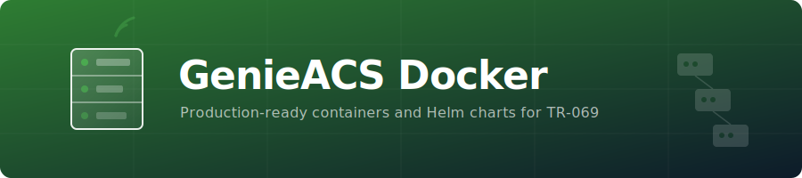

<p align="center">
  
</p>

<p align="center">
  
</p>

<h1 align="center">GenieACS Docker</h1>

<p align="center">
  <a href="https://hub.docker.com/r/drumsergio/genieacs"></a>
  <a href="https://github.com/GeiserX/genieacs-docker/stargazers"></a>
  <a href="https://github.com/GeiserX/genieacs-docker/blob/main/LICENSE"></a>
</p>

<p align="center">
  <strong>Production-ready Docker containers and deployment tools for <a href="https://genieacs.com">GenieACS</a>, an open-source TR-069 ACS.</strong>
</p>

## Table of Contents

- [Features](#features)
- [Quick Start](#quick-start)
- [Deployment Methods](#deployment-methods)
  - [Docker Compose](#docker-compose)
  - [Kubernetes with Helm](#kubernetes-with-helm)
- [Configuration](#configuration)
- [Ports](#ports)
- [Volumes](#volumes)
- [Environment Variables](#environment-variables)
- [Maintainers](#maintainers)
- [Contributing](#contributing)
- [License](#license)

## Features

- 🐳 **Production-ready Docker images** for GenieACS v1.2.16.0
- ☸️ **Official Helm chart** for Kubernetes deployments
- 🔄 **Automated chart releases** via GitHub Actions
- 🔒 **Security best practices** (non-root user, security contexts, etc.)
- 📊 **Health checks** and monitoring support
- 📦 **Multi-architecture support** (amd64, arm64)

## Quick Start

### Docker Compose

The fastest way to get started:

```bash
docker compose up -d
```

This will start:
- GenieACS (ports 7547, 7557, 7567, 3000)
- MongoDB (internal port 27017)

Access the GenieACS UI at: http://localhost:3000

### Docker Run

```bash
docker run -d \
  --name genieacs \
  -p 7547:7547 \
  -p 7557:7557 \
  -p 7567:7567 \
  -p 3000:3000 \
  -e GENIEACS_MONGODB_CONNECTION_URL=mongodb://your-mongo-host/genieacs \
  -e GENIEACS_UI_JWT_SECRET=your-secret-here \
  drumsergio/genieacs:1.2.16.0
```

## Deployment Methods

### Docker Compose

The included `docker-compose.yml` provides a complete stack with GenieACS and MongoDB:

```bash
# Start all services
docker compose up -d

# View logs
docker compose logs -f genieacs

# Stop all services
docker compose down

# Stop and remove volumes
docker compose down -v
```

**Optional Services:**
- `genieacs-sim`: Testing simulator (use `--profile testing`)
- `genieacs-mcp`: MCP Server (use `--profile mcp`)

### Kubernetes with Helm

#### Using the Official Chart Repository

Add the chart repository:

```bash
helm repo add genieacs https://geiserx.github.io/genieacs-docker
helm repo update
```

Install GenieACS:

```bash
helm install genieacs genieacs/genieacs \
  --namespace genieacs \
  --create-namespace \
  --set env.GENIEACS_UI_JWT_SECRET=your-secret-here
```

This deploys GenieACS with a MongoDB instance included by default (no auth). For production with MongoDB auth:

```bash
helm install genieacs genieacs/genieacs \
  --namespace genieacs \
  --create-namespace \
  --set mongodb.auth.enabled=true \
  --set mongodb.auth.rootPassword=your-secure-password \
  --set env.GENIEACS_UI_JWT_SECRET=your-secret-here
```

To use an external MongoDB instead:

```bash
helm install genieacs genieacs/genieacs \
  --namespace genieacs \
  --create-namespace \
  --set mongodb.enabled=false \
  --set externalMongodb.url=mongodb://your-mongo-host/genieacs
```

#### Using Helmfile

See the [examples directory](examples/) for a complete Helmfile deployment example:

```bash
helmfile -f examples/helmfile.yaml apply
```

#### Chart Configuration

Key configuration options in `values.yaml`:

```yaml
image:
  repository: drumsergio/genieacs
  tag: "1.2.16.0"

replicaCount: 1

ingress:
  enabled: false
  className: ""  # e.g. "nginx", "traefik"

env:
  GENIEACS_UI_JWT_SECRET: changeme

# Inject env vars from Kubernetes Secrets/ConfigMaps
envFrom: []
# - secretRef:
#     name: genieacs-secrets

# Env vars with valueFrom (e.g. secretKeyRef)
extraEnvVars: []

# Bitnami MongoDB subchart (deployed alongside GenieACS by default)
mongodb:
  enabled: true
  auth:
    enabled: false
  persistence:
    enabled: true
    size: 8Gi

# Used when mongodb.enabled is false
externalMongodb:
  url: ""

persistence:
  enabled: true
  size: 5Gi

resources:
  limits:
    memory: 4Gi
  requests:
    cpu: 500m
    memory: 2Gi
```

For complete configuration options, see [charts/genieacs/values.yaml](charts/genieacs/values.yaml).

## Configuration

### Ports

| Port | Service | Description |
|------|---------|-------------|
| 7547 | CWMP | TR-069 ACS port for device communication |
| 7557 | NBI | Northbound Interface API |
| 7567 | FS | File Server for firmware/configuration files |
| 3000 | UI | Web-based user interface |

### Volumes

- `/opt/genieacs/ext`: Extension scripts directory
- `/var/log/genieacs`: Log files directory

### Environment Variables

| Variable | Description | Default |
|----------|-------------|---------|
| `GENIEACS_MONGODB_CONNECTION_URL` | MongoDB connection string | Auto-configured when `mongodb.enabled=true` |
| `GENIEACS_UI_JWT_SECRET` | JWT secret for UI authentication | `changeme` |
| `GENIEACS_EXT_DIR` | Extension scripts directory | `/opt/genieacs/ext` |
| `GENIEACS_CWMP_ACCESS_LOG_FILE` | CWMP access log path | `/var/log/genieacs/genieacs-cwmp-access.log` |
| `GENIEACS_NBI_ACCESS_LOG_FILE` | NBI access log path | `/var/log/genieacs/genieacs-nbi-access.log` |
| `GENIEACS_FS_ACCESS_LOG_FILE` | FS access log path | `/var/log/genieacs/genieacs-fs-access.log` |
| `GENIEACS_UI_ACCESS_LOG_FILE` | UI access log path | `/var/log/genieacs/genieacs-ui-access.log` |
| `GENIEACS_DEBUG_FILE` | Debug log path | `/var/log/genieacs/genieacs-debug.yaml` |

## Building the Image

To build the Docker image locally:

```bash
docker build -t drumsergio/genieacs:1.2.16.0 .
```

For multi-architecture builds:

```bash
docker buildx build --platform linux/amd64,linux/arm64 \
  -t drumsergio/genieacs:1.2.16.0 \
  -t drumsergio/genieacs:latest \
  --push .
```

## Security Considerations

- The container runs as a non-root user (`genieacs`)
- Security contexts are configured in the Helm chart
- Default JWT secret should be changed in production
- Use `envFrom` or `extraEnvVars` to inject secrets from Kubernetes Secrets instead of hardcoding in `values.yaml`
- MongoDB authentication should be enabled for production deployments

## Troubleshooting

### Check Container Logs

```bash
docker compose logs genieacs
```

### Verify MongoDB Connection

```bash
docker compose exec genieacs ping mongo
```

### Access Container Shell

```bash
docker compose exec genieacs /bin/bash
```

## Maintainers

[@GeiserX](https://github.com/GeiserX)

## Contributing

Contributions are welcome! Please feel free to submit a Pull Request.

1. Fork the repository
2. Create your feature branch (`git checkout -b feature/amazing-feature`)
3. Commit your changes (`git commit -m 'Add some amazing feature'`)
4. Push to the branch (`git push origin feature/amazing-feature`)
5. Open a Pull Request

GenieACS-Docker follows the [Contributor Covenant](http://contributor-covenant.org/version/2/1/) Code of Conduct.

## GenieACS Ecosystem

This image is part of a broader set of tools for working with GenieACS:

| Project | Description |
|---------|-------------|
| [genieacs-mcp](https://github.com/GeiserX/genieacs-mcp) | MCP Server (Go) for AI/LLM integration with GenieACS |
| [genieacs-sim-docker](https://github.com/GeiserX/genieacs-sim-docker) | Containerised GenieACS Simulator for testing and development |
| [genieacs-services](https://github.com/GeiserX/genieacs-services) | Systemd & Supervisord service files for bare-metal installs |
| [genieacs-ha](https://github.com/GeiserX/genieacs-ha) | Home Assistant integration for TR-069 router management |

> The simulator is also available as an optional Docker Compose profile in this repo (`--profile testing`).

## License

This project is licensed under the same license as GenieACS. See [LICENSE](LICENSE) file for details.

